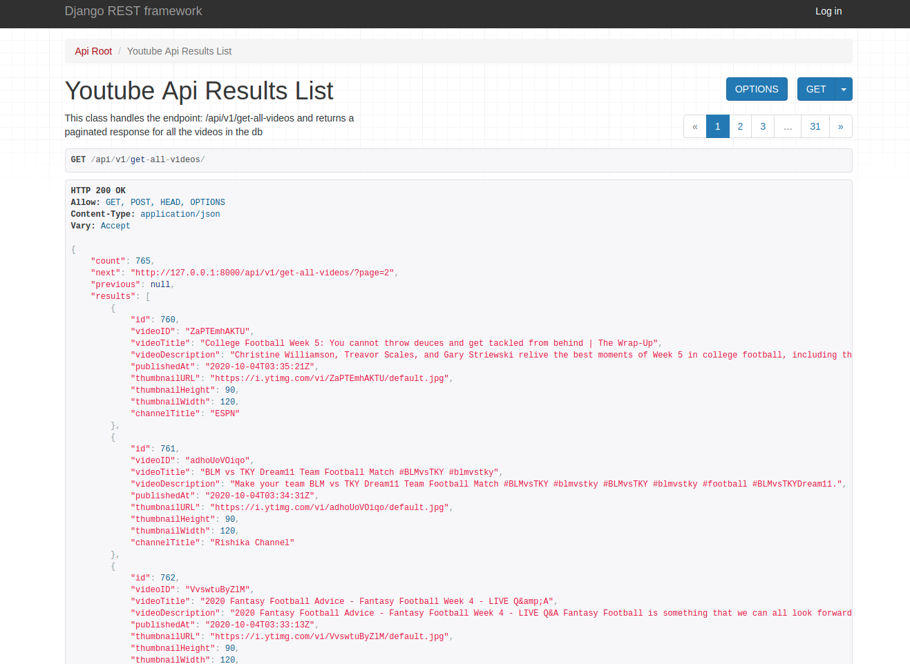
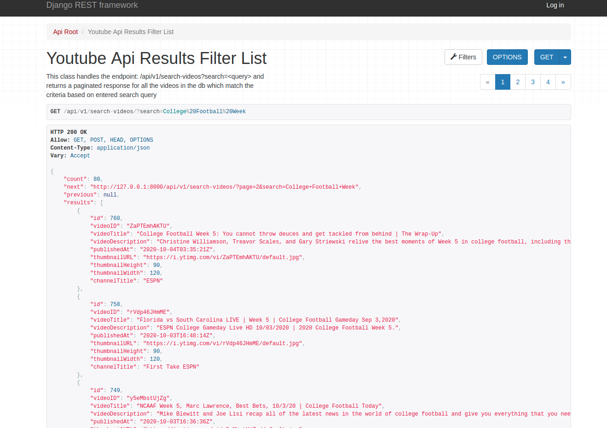
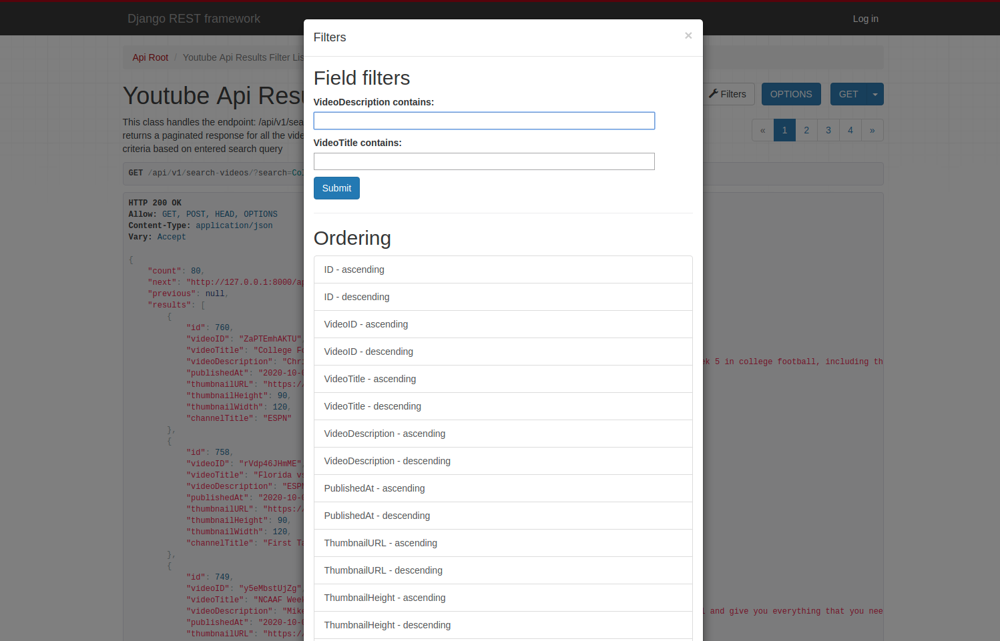

# Youtube Search API
## Project Goal:  
An API to fetch latest videos sorted in reverse chronological order of their publishing date-time from YouTube for a given tag/search query in a paginated response.

## Libraries used:
* Django
* Django-REST
* Celery
* Redis
* google-api-python-client

## API endpoints:
* /api/v1/get-all-videos: This endpoint implements a GET API which returns the stored video data in a paginated response sorted in descending order of published datetime.   
* /api/v1/search-videos/?search=\<query> : This endpoint implements a A basic search API to search the stored videos using their title and description.

## Setup Instructions:

* Clone this project
* Add the GOOGLE_API_KEYS to .env file in the base directory as GOOGLE_API_KEYS="KEY1,KEY2...."
* Build the docker image using:  docker-compose up -d --build

## Endpoints:
* http://127.0.0.1:8000/api/v1/get-all-videos/
* http://127.0.0.1:8000/api/v1/search-videos/
* Search Example: http://127.0.0.1:8000/api/v1/search-videos/?search=Premier%20League

##Screenshots

### API 1

###API 2

### API 2 (filter by fields)

 
